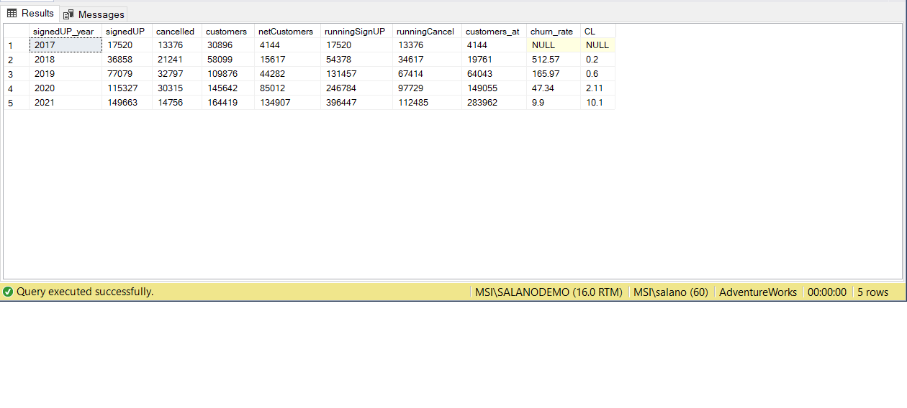

This repository contains the processes to compute customer churn, and customer lifetime value analyses in SQL.
The original dataset is taken from the kaggle website and can be found here: https://www.kaggle.com/datasets/gsagar12/dspp1?resource=download - the 'customer_product' dataset was imported into the Adventureworks database into table 'Demo.customer_product'.

The dataset is contains four column: customer_id, product, signup_date_time and cancel_date_time.


We will use the following terms and cormulas in our churn calculation.

Existing customers (prior period - month, year)
New customers (current period)
Cancelled customers (current period)
Total customers at end of month = Existing customers + New customers - Cancelled customers

Churn rate = (Cancelled customers / Existing customers ) \* 100
Customer lifetime = 1 / Churn rate

First we identify all signups and cancellations - signedUP and cancelled

```
Select
	CONCAT(CAST(YEAR(signup_date_time) as varchar(4)) , FORMAT (signup_date_time, 'MM')) signedUP_month,
	DATEDIFF(MONTH, signup_date_time, cancel_date_time) months_to_cancel,
	CASE WHEN cancel_date_time is NULL then 1
		ELSE 0
	END signedUP,
	CASE WHEN cancel_date_time is not NULL then 1
		ELSE 0
	END cancelled,
	1 as customer
from
	Demo.customer_product
```

Next we summarize the signups, cancellations, and customers by months

```
select
	signedUP_month,
	sum(signedUP)  signedUP,
	sum(cancelled)  cancelled,
	sum(customer) customers,
	sum(signedUP -cancelled)  netCustomers
from
	cust_prod
group by
	signedUP_month
```

We now calculate the running signups and cancellations. We subtract the running cancellations from the running signups to give ust the amount of customers at a given period.

```
select
	*,
	sum(signedUP) over (order by signedUP_month
		ROWS UNBOUNDED PRECEDING) as runningSignUP,
	sum(cancelled) over (order by signedUP_month
		ROWS UNBOUNDED PRECEDING) as runningCancel,

	sum(signedUP) over (order by signedUP_month
		ROWS UNBOUNDED PRECEDING) - sum(cancelled) over (order by signedUP_month
		ROWS UNBOUNDED PRECEDING) as customers_at

from
	cust_summary
```

We next divide the cancellations by the previous period customers to give us the churn rate.

```
select
	*,
	round(100 * (CAST(cancelled as float) / LAG(cast(customers_at as float)) over (order by signedUP_month)),2)  churn_rate
from
	cust_at_month
order by
	signedUP_month
```

The complete code is below

```

with cust_prod as
(
Select
	CONCAT(CAST(YEAR(signup_date_time) as varchar(4)) , FORMAT (signup_date_time, 'MM')) signedUP_month,
	DATEDIFF(MONTH, signup_date_time, cancel_date_time) months_to_cancel,
	CASE WHEN cancel_date_time is NULL then 1
		ELSE 0
	END signedUP,
	CASE WHEN cancel_date_time is not NULL then 1
		ELSE 0
	END cancelled,
	1 as customer
from
	Demo.customer_product
)
,cust_summary as
(
select
	signedUP_month,
	sum(signedUP)  signedUP,
	sum(cancelled)  cancelled,
	sum(customer) customers,
	sum(signedUP -cancelled)  netCustomers
from
	cust_prod
group by
	signedUP_month


),
cust_at_month as
(
select
	*,
	sum(signedUP) over (order by signedUP_month
		ROWS UNBOUNDED PRECEDING) as runningSignUP,
	sum(cancelled) over (order by signedUP_month
		ROWS UNBOUNDED PRECEDING) as runningCancel,

	sum(signedUP) over (order by signedUP_month
		ROWS UNBOUNDED PRECEDING) - sum(cancelled) over (order by signedUP_month
		ROWS UNBOUNDED PRECEDING) as customers_at

from
	cust_summary
)
select
	*,
	round(100 * (CAST(cancelled as float) / LAG(cast(customers_at as float)) over (order by signedUP_month)),2)  churn_rate
from
	cust_at_month
order by
	signedUP_month
	;

```

Our results show that while cancellations remains high and fluctuates, we experience continued customers growth and declining churn rates. This trend applies to both monthly and yearly churn.

Monthly churn results


Yearly churn results


We use the monthly average to give us a month churn figure to calculate the monthly lifetime value. The yearly lifetime value was calculate directly from the dataset.

Customer lifetime (months): 1 / 0.2838 = 3.5

Customer lifetime (years):


We can see that customers lifetime increases overtime. starting with 0.2 of a year (2.4 months) in 2017 to 10.1 (121.2 months) years in 2021.

code

```
with cust_prod as
(
Select
	CAST(YEAR(signup_date_time) as varchar(4))  signedUP_year,
	DATEDIFF(YEAR, signup_date_time, cancel_date_time) year_to_cancel,
	CASE WHEN cancel_date_time is NULL then 1
		ELSE 0
	END signedUP,
	CASE WHEN cancel_date_time is not NULL then 1
		ELSE 0
	END cancelled,
	1 as customer
from
	Demo.customer_product
)
,cust_summary as
(
select
	signedUP_year,
	sum(signedUP)  signedUP,
	sum(cancelled)  cancelled,
	sum(customer) customers,
	sum(signedUP -cancelled)  netCustomers
from
	cust_prod
group by
	signedUP_year


),
cust_at_year as
(
select
	*,
	sum(signedUP) over (order by signedUP_year
		ROWS UNBOUNDED PRECEDING) as runningSignUP,
	sum(cancelled) over (order by signedUP_year
		ROWS UNBOUNDED PRECEDING) as runningCancel,

	sum(signedUP) over (order by signedUP_year
		ROWS UNBOUNDED PRECEDING) - sum(cancelled) over (order by signedUP_year
		ROWS UNBOUNDED PRECEDING) as customers_at

from
	cust_summary
)
select
	*,
	round(100 * (CAST(cancelled as float) / LAG(cast(customers_at as float)) over (order by signedUP_year)),2)  churn_rate,
	round(1 / ( (CAST(cancelled as float) / LAG(cast(customers_at as float)) over (order by signedUP_year))),2) CL
from
	cust_at_year
order by
	signedUP_year
	;
```

Presentation:


